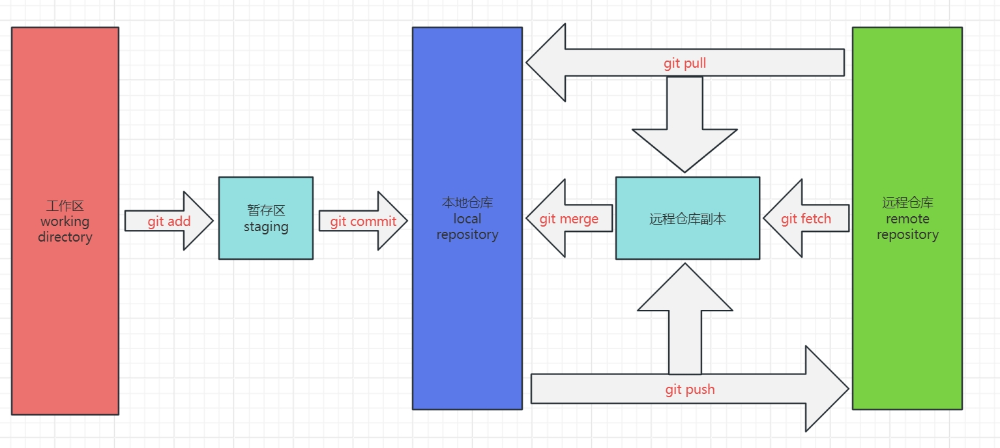

#### git整体架构

* git pull 实际上是 git fetch + git merge
* 远程仓库副本，实际存储在本地，是远程仓库的副本，也可以看作是远程仓库的缓存
* 冲突是从本地仓库push到远程仓库、从远程仓库副本merge到本地仓库、从远程仓库pull到本地仓库过程出现的 
* git clone 用于从远程仓库克隆到本地，在本地创建了工作区、暂存区、远程仓库缓存
* git merge 用于处理本地仓库和远程仓库、本地仓库和远程仓库缓存区的冲突
* git init 用于创建工作区、暂存区、本地仓库、远程仓库缓存
